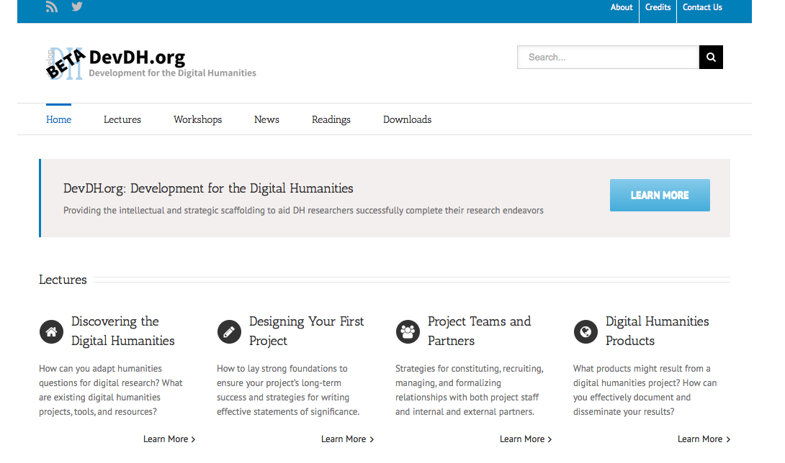
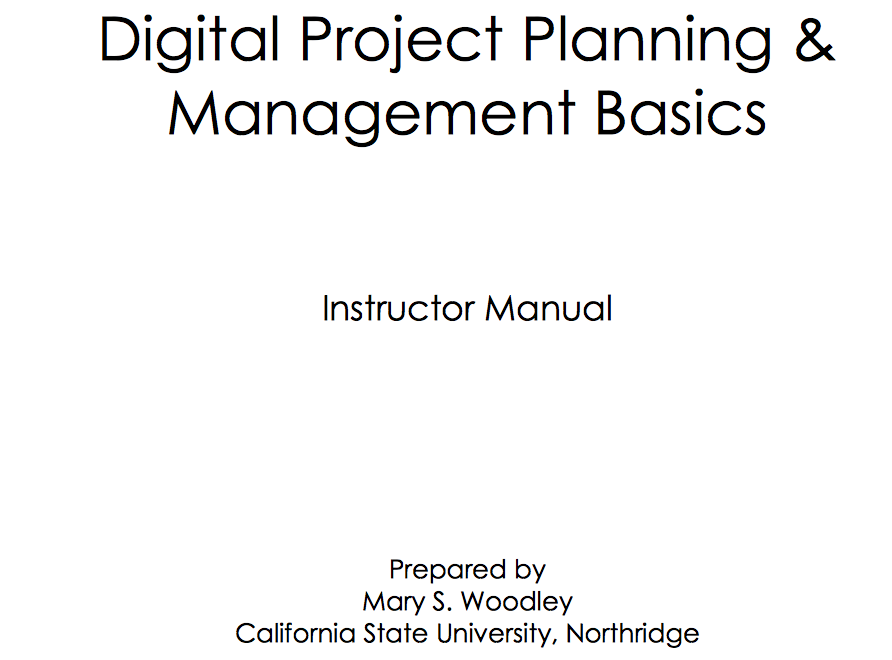
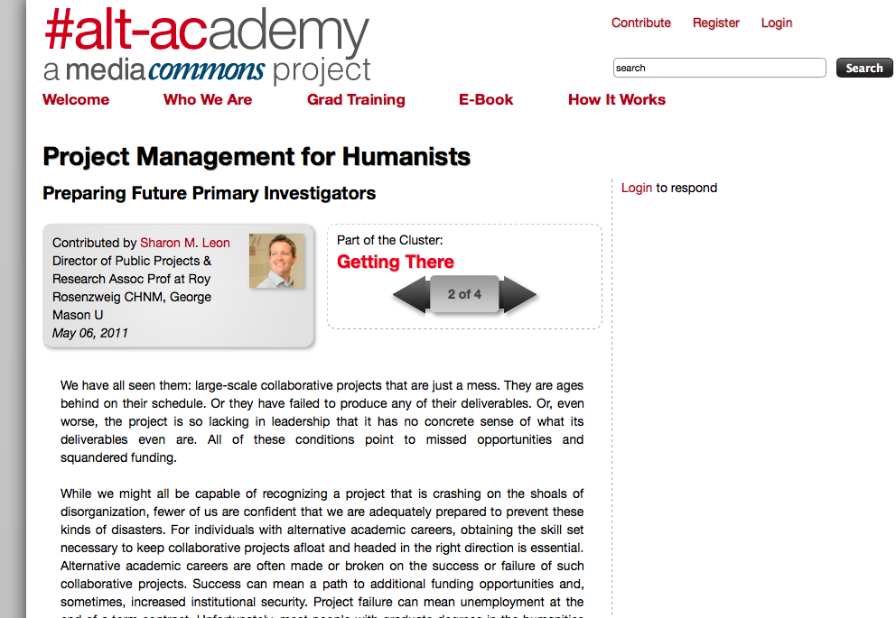
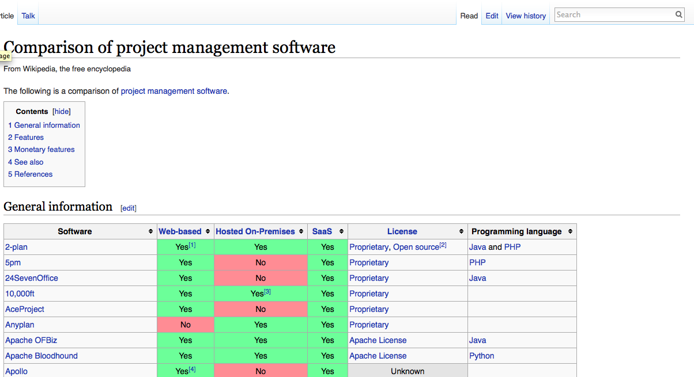
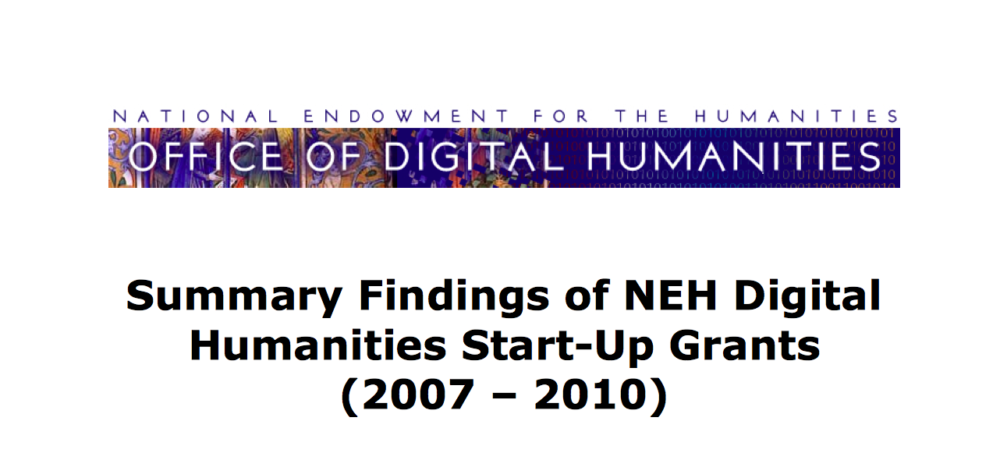
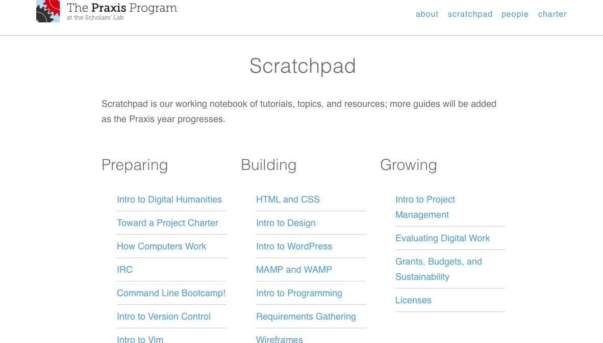
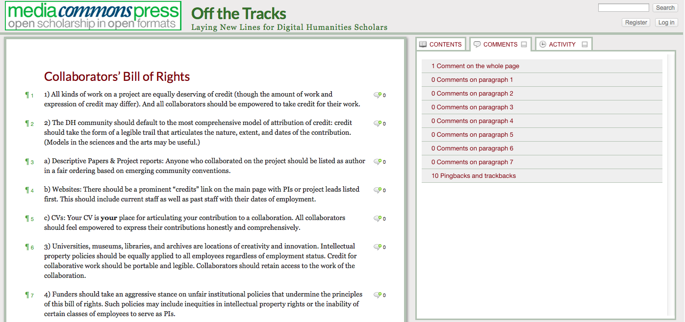
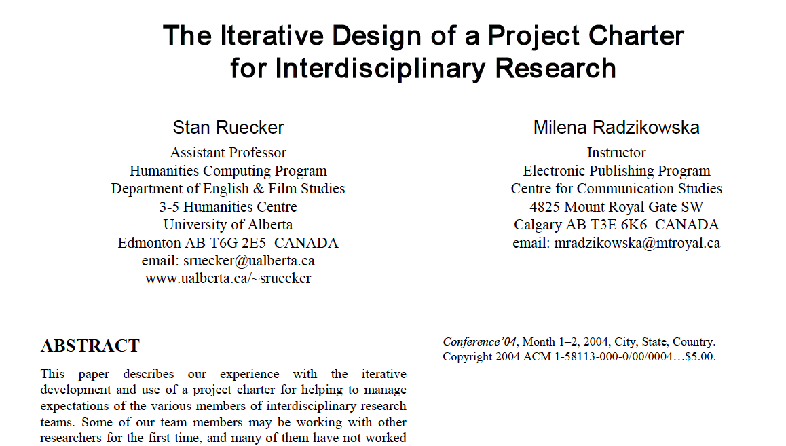
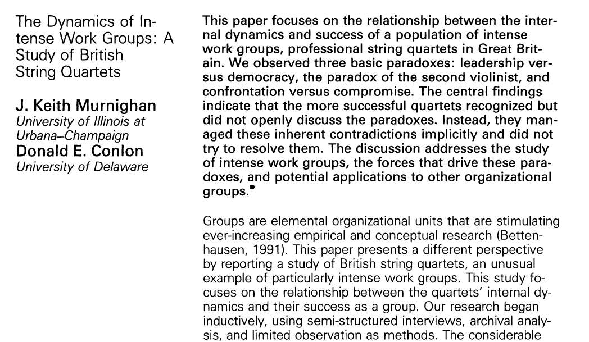
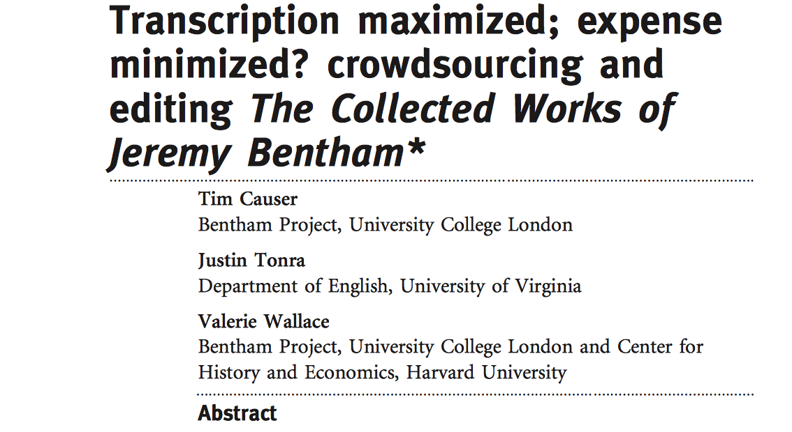

--- 
title: Digital Pedagogy in the Humanities
subtitle: Concepts, Models, and Experiments 
chapter: Project Management
URL: keywords/projectManagement.md
author: 
- family: Siemens
  given: Lynne
editor: 
- family: Sayers
  given: Jentery
publisher: Modern Language Association
type: book
---

# PROJECT MANAGMENT 

## Lynne Siemens
University of Victoria | [Website](https://lynnesiemens.wordpress.com)

---

##### Publication Status:
* **unreviewed draft**
* draft version undergoing editorial review
* draft version undergoing peer-to-peer review
* published

--- 

## CURATORIAL STATEMENT

Along with those in the social sciences, humanities researchers, librarians, content experts, students and others are turning to collaborations to explore increasingly complex questions and implement new types of methodologies and tools, such as those in the Digital Humanities (DH).  Further, granting agencies are encouraging this trend with targeted programs such as Digging into Data and Partnership Grants, among others.  As a result, teams need to understand ways to coordinate efforts among tasks and members in order to accomplish project objectives and satisfy stakeholders (Siemens and INKE Research Group 2014; Siemens 2009).  Project Management with its associated methods, tools and techniques provide a way to do this (Siemens 2012).

While most individuals would not (hopefully) deny the need for the effective planning and managing of projects, knowledge and skills about the topic are typically not a formal part of training in the field (Leon 2011; Siemens 2013). Instead, the gap tends to be filled as part of DH-oriented courses, such as Bailar and Spiro’s Introduction to Digital Humanities (Bailar and Spiro 2013), training programs such as the Praxis Program at the Scholar’s Lab (2011), project management workshops at Humanities Intensive Teaching and Learning (HILT 2015), Digital Humanities Summer Institute (DHSI 2015), and the European Summer University in Digital Humanities (2015), and/or the school of hard learned experience, often very effective but not necessarily efficient (Guiliano 2012; Simeone et al. 2011; Causer, Tonra and Wallace 2012; Siemens and INKE Research Group 2012; 2013; National Endowment for the Humanities Office of Digital Humanities 2010).

Hence, the need for a resource such as this one which pulls together repositories, websites, articles and reflections on project management and its many component parts.  What follows below is a variety of materials that could be used within an undergraduate and graduate courses on project management specifically and DH more generally or as foundations for workshops on the topic.  Those who are ready part of a project will find these resources useful for undertaking initial planning and/or managing ongoing work.  

## CURATED ARTIFACTS 

### DevDH

 
* Source URL: http://devdh.org
* Creator: Jennifer Guiliano (Indiana University-Purdue University Indianapolis) and Simon Appleford (Creighton University)

Jennifer Guiliano and Simon Appleford created this site, drawing on their experience as project managers and team members.  It is a repository of training materials, recorded lectures, exemplars and links about project management within the Digital Humanities.  It covers topics such as team development, budgeting, publicity campaigns, data management and others.  This resource would be useful in project management workshops and courses and individuals planning their first (or subsequent) project.  It should be noted that the budget section is oriented towards American funding agencies.

### Digital Project Planning and Management Basics, Instructor Manual 

* Source URL: http://www.loc.gov/catworkshop/courses/digitalprojplan/pdf/Instructor-Final.pdf  
* Creator: Mary S. Woodley (California State University, Northridge)

This is a workshop manual for a 2-day workshop on digital project management, developed on behalf of the Library of Congress and the Association for Library Collections and Technical Services.  Topics include team building and planning, business plan development, planning and grant writing, project management, and outcome evaluation and assessment.  It includes slides, instructor notes and classroom activities and exercises.  The accompanying trainee manual is available at http://www.loc.gov/catworkshop/courses/digitalprojplan/pdf/Trainee-Final.pdf.  These guides would be useful as a resource within courses and workshop and individuals planning and managing their projects.

### Project Management for Humanists: Preparing Future Primary Investigators 

* Source URL: http://mediacommons.futureofthebook.org/alt-ac/pieces/project-management-humanists
* Creator: Sharon M. Leon (George Mason University)

Drawing upon her perhaps hard learned experiences, Sharon Leon presents a guide to project management, geared to the humanist undertaking their first project. She covers topics such as managing the project, running efficient meeting and managing the project manager.  She also offers some thoughts on models for changing graduate education to better prepare huamanists for life as project work and collaborations.  Anyone who is looking for a “getting started” guide to project management will find this a useful article.

### Comparison of Project Management Software

* Source URL: http://en.wikipedia.org/wiki/Comparison_of_project_management_software
* Creator: The Crowd

People often ask which software is best to use for project management to which no easy answer exists.  This Wikipedia page provides a comparison of the plethora of project management software across criteria such as whether web-based, hosted on premises, proprietary and/or open source, and the programming language. It should be noted that this list does not include apps and “low tech” methods such as white boards, flip charts, post-it notes and markers. 

### Office of NEH Progress Reports on Grants (Summary Findings of NEH Digital Humanities Start-Up Grants, 2007–2010)

* Source URL: http://www.neh.gov/files/divisions/odh/odh-resource-summary.report.odh_.sug_.pdf
* Creator: National Endowments for the Humanities

While this may seem like a surprising choice for a list such as this, this resource provides a summary of outcomes from the first round of National Endowment of the Humanities Digital Humanities Start-up Grants, including a survey of project directors and a summary of end-of-grant “white papers” which distilled the lessons learned from the projects.  Among other things, respondents reflected on the importance of goal setting, team work, and contingencies planning.  Anyone planning their first project and applying for funding would find this report an interesting read.

### The Praxis Program at the Scholar’s Lab

* Source URL: http://praxis.scholarslab.org
* Creator: The Scholars’ Lab (University of Virginia) 

The Praxis Program at the Scholar’s Lab is a training program in which graduate students at University of Virginia are funded to work as a team to develop a digital humanities project or tool.  To prepare them for this work, the program has developed a series of modules, including “toward a project charter”, “intro to project management” and “grants, budgets and sustainability.”  The participants regularly blog about their experiences.  The blog and associated resources would be appropriate for project management workshops and courses.

### Collaborators’ Bill of Rights

* Source URL: http://mcpress.media-commons.org/offthetracks/part-one-models-for-collaboration-career-paths-acquiring-institutional-support-and-transformation-in-the-field/a-collaboration/collaborators’-bill-of-rights/
* Creator: Participants in the “Off the Tracks: Laying New Lines for Digital Humanities Scholars” Workshop

Teamwork and collaboration is a key component of any project, particularly within the Digital Humanities.  However, clear models for recognizing team member contributions to digital projects are not present within the Humanities with its historical emphasis on the single author.  As a result, the participants of the “Off the Tracks – Laying New Lines for Digital Humanities Scholars” workshop developed the collaborators’ bill of rights with the fundamental principle that “all kinds of work on a project are equally deserving of credit…”  Anyone starting a digital project with other individuals will want to refer to this document to guide discussions about ways to recognize effort within the project.

### The iterative design of a project charter for interdisciplinary research 

* Source URL: http://dl.acm.org/citation.cfm?id=1394476
* Creator: Stan Ruecker (Illinois Institute of Technology) and Milena Radzikowska (Mount Royal University)

This paper outlines Stan Ruecker and Milena Radzikowska’s experience using a project charter within their collaborations as a way to reduce misunderstandings.  This charter makes explicit several principles that guide the working relationship between researchers from different disciplines. This article will be of interest to anyone who is looking for a project charter template for their digital project.

### The Dynamics of Intense Work Groups: A Study of British String Quartets

* Source URL: http://www.jstor.org/stable/2393352?seq=1#page_scan_tab_contents
* Creators: J. Keith Murnighan (University of Illinois at Urbana-Champaign) and Donald E. Conlon (University of Delware)

This article provides an interesting comparison between work groups and string quartets, between the balance of the individual and team.  A successful string quartets are by definition both individualistic with different instruments playing a variety of parts, and yet highly interdependent as they play a coordinated sound. Like productive research collaborations, there is little room for individually focused musicians in successful string quarters.  This article would be a good ready for anyone trying to determine if they are ready to work within a team.

### Transcription Maximized; Expense Minimized? Crowdsourcing and Editing the Collected Works of Jeremy Bentham

 
* Source URL: http://llc.oxfordjournals.org/content/early/2012/03/28/llc.fqs004.full.pdf
* Creator: Tim Causer (University College London), Justin Tonra (University of Virginia), and Valerie Wallace (University College London/Harvard University)

An important part of project management is reflection at a project’s completion to determine lessons learned a step not often taken by teams.  This article is an exception with an excellent review of the Transcribe Bentham project touching on evaluation of project success against cost-effectiveness and public engagement and access, quality control, volunteer management, and other topics.  These lessons are relevant to anyone considering a crowdsourcing project and other forms of digital projects. 

## RELATED MATERIALS

Duarte, Deborah L., and Nancy Tennant Snyder. Mastering Virtual Teams. 3rd ed. New York, New York: John Wiley & Sons, Inc., 2006.

Howard Hughes Medical Institute, and Burroughs Wellcome Fund. Making the Right Moves: A Practical Guide to Scientific Management for Postdocs and New Faculty. 2nd ed. Research Triangle Park, North Carolina: Howard Hughes Medical Institute, Burroughs Wellcome Fund, 2006.

Knutson, Joan, and Ira Bitz. Project Management: How to Plan and Manage Successful Projects. New York, New York: AMACOM, 1991.

Olson, Gary M., and Judith S. Olson. "Distance Matters." Human-Computer Interaction 15.2/3 (2000): 139-78.

Siemens, Lynne, and INKE Research Group. "INKE Administrative Structure: Omnibus Document." Scholarly and Research Communication 3.1 (2012). http://src-online.ca/index.php/src/article/view/50

## WORKS CITED

Appleford, Simon, and Jennifer Guiliano. "Devdh: Development for the Digital Humanities". 2013. March 5, 2015. <http://devdh.org>.

Bailar, Melissa, and Lisa Spiro. "Introduction to Digital Humanities". 2013. March 5, 2015. <http://digitalhumanities.rice.edu/fall-2013-syllabus/%3E.

Causer, Tim, Justin Tonra, and Valerie Wallace. "Transcription Maximized; Expense Minimized? Crowdsourcing and Editing the Collected Works of Jeremy Bentham." Literary & Linguistic Computing 27.2 (2012): 119-37.

"Comparison of Project Management Software". 2015. The Free Encyclopedia. Wikimedia Foundation Wikipedia, Inc.: March 5, 2015. <http://en.wikipedia.org/wiki/Comparison_of_project_management_software>.

DHSI. "Digital Humanitites Summer Institute". 2015. March 5, 2015. <http://dhsi.org/%3E.

Guiliano, J. "NEH Project Director’s Meeting: Lessons for Promoting Your Project." MITH Blog 2012. Vol. October 3, 2012.

HILT. "Courses". 2015. March 5, 2015. <http://www.dhtraining.org/hilt2015/%3E.

Howard Hughes Medical Institute, and Burroughs Wellcome Fund. Making the Right Moves: A Practical Guide to Scientific Management for Postdocs and New Faculty. 2nd ed. Research Triangle Park, North Carolina: Howard Hughes Medical Institute, Burroughs Wellcome Fund, 2006.

Knutson, Joan, and Ira Bitz. Project Management: How to Plan and Manage Successful Projects. New York, New York: AMACOM, 1991.

Leon, Sharon M. "Project Management for Humanists: Preparing Future Primary Investigators". 2011. June 24, 2011. <http://mediacommons.futureofthebook.org/alt-ac/pieces/project-management-humanists%3E.

Murnighan, J. Keith, and Donald E. Conlon. "The Dynamics of Intense Work Groups: A Study of British String Quartets." Administrative Science Quarterly 36.2 (1991): 165-86.

National Endowment for the Humanities Office of Digital Humanities. Summary Findings of NEH Digital Humanities Start-up Grants (2007-2010). Washington, D.C.: National Endowment for the Humanities, 2010.

Off the Tracks. "Collaborators’ Bill of Rights". 2011. March 5, 2015. <http://mcpress.media-commons.org/offthetracks/part-one-models-for-collaboration-career-paths-acquiring-institutional-support-and-transformation-in-the-field/a-collaboration/collaborators’-bill-of-rights/>.

Olson, Gary M., and Judith S. Olson. "Distance Matters." Human-Computer Interaction 15.2/3 (2000): 139-78.

Ruecker, Stan, and Milena Radzikowska. "The Iterative Design of a Project Charter for Interdisciplinary Research." DIS 2007. 2007.

Scholars' Lab. "The Praxis Program at the Scholars' Lab". 2011. September 12, 2011. <http://praxis.scholarslab.org/%3E.

Siemens, Lynne. "DHSI Project Planning Course Pack". 2012. March 5, 2015. <http://dhsi.org/content/2012Curriculum/12.ProjectPlanning.pdf%3E.

Siemens, Lynne. "'It's a Team If You Use "Reply All": An Exploration of Research Teams in Digital Humanities Environments." Literary & Linguistic Computing 24.2 (2009): 225-33.

Siemens, Lynne. "Meta-Methodologies and the DH Methodological Commons: Potential Contribution of Management and Entrepreneurship to Dh Skill Development." DH 2013. 2013.

Siemens, Lynne, and INKE Research Group. "Firing on All Cylinders: Progress and Transition in INKE's Year 2." Scholarly and Research Communication 3.4 (2012): 1-16.

Siemens, Lynne, and INKE Research Group. "INKE Administrative Structure: Omnibus Document." Scholarly and Research Communication 3.1 (2012). 

Siemens, Lynne, and INKE Research Group. "Research Collaboration as “Layers of Engagement”: INKE in Year Four." Scholarly and Research Communication 5.4 (2014): 1-12.

Siemens, Lynne, and INKE Research Group. "Responding to Change and Transition in INKE’s Year Three." Scholarly and Research Communication 4.3 (2013): 12 pp.

Simeone, M., et al. "Digging into Data Using New Collaborative Infrastructures Supporting Humanities-Based Computer Science Research." First Monday 16.5 (2011).

The European Summer University in Digital Humanities. ""Culture & Technology" - the European Summer University in Digital Humanities". 2015. March 5, 2015. <http://www.culingtec.uni-leipzig.de/ESU_C_T/node/97%3E.

Woodley, Mary S. Digital Project Planning & Management Basics: Instructor Manual, 2008.

